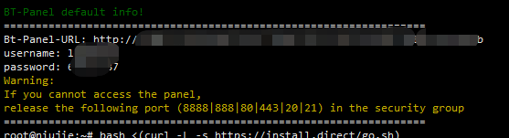
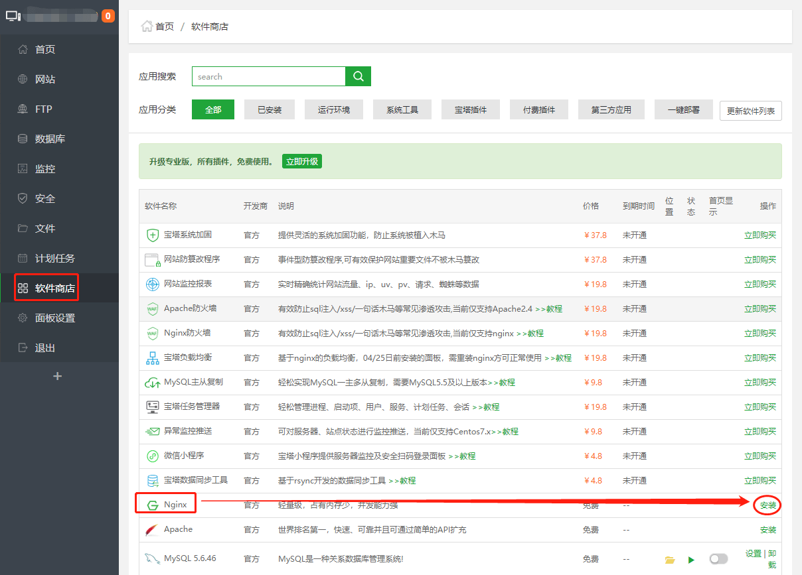
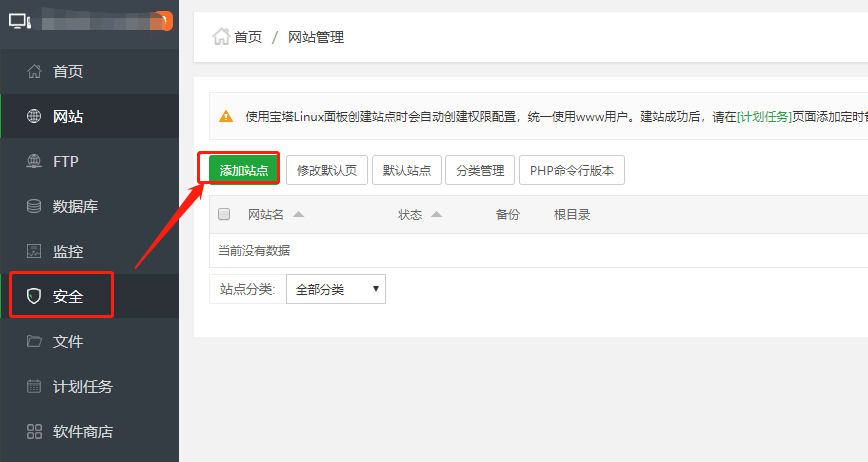
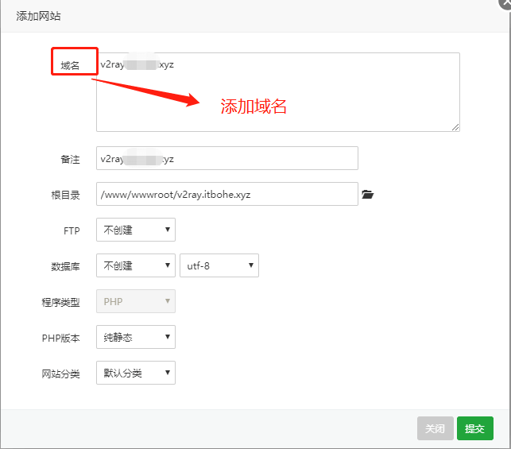
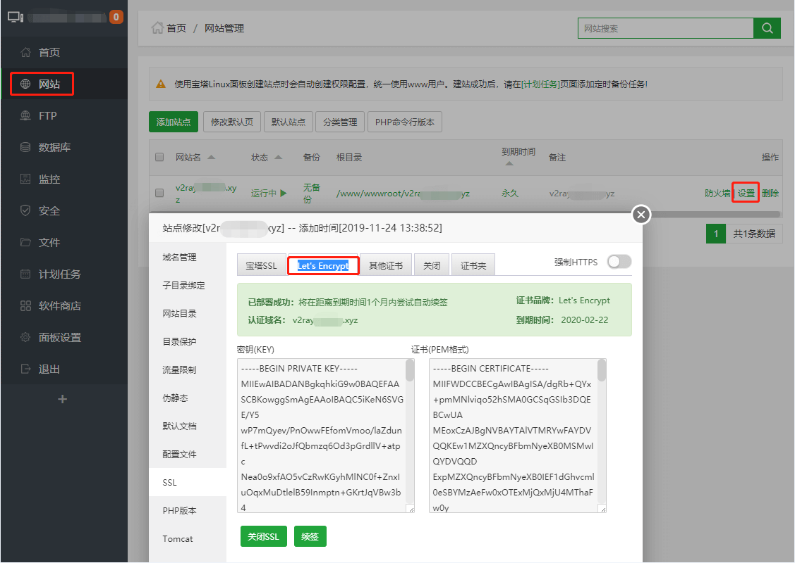
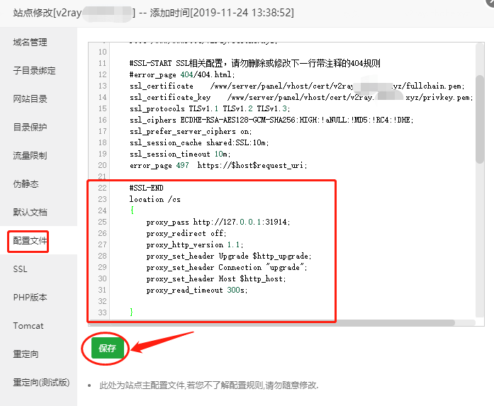
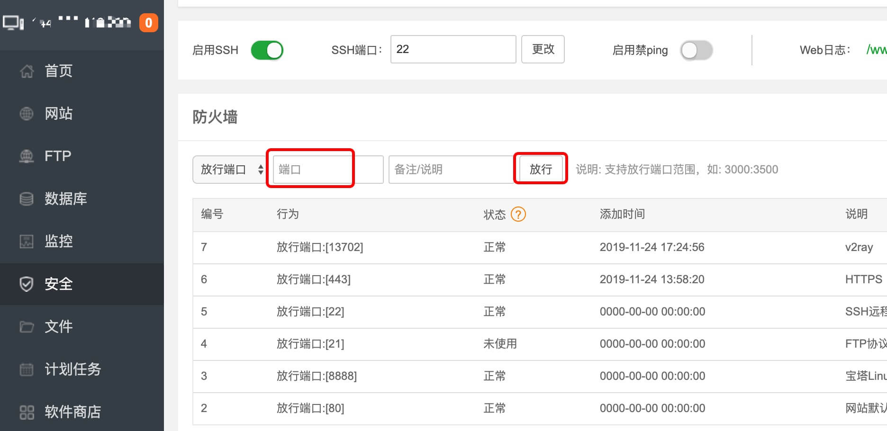
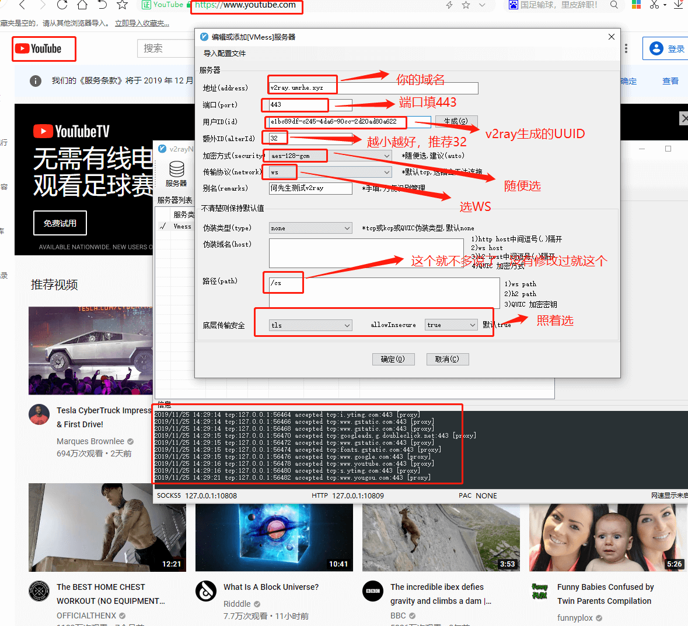
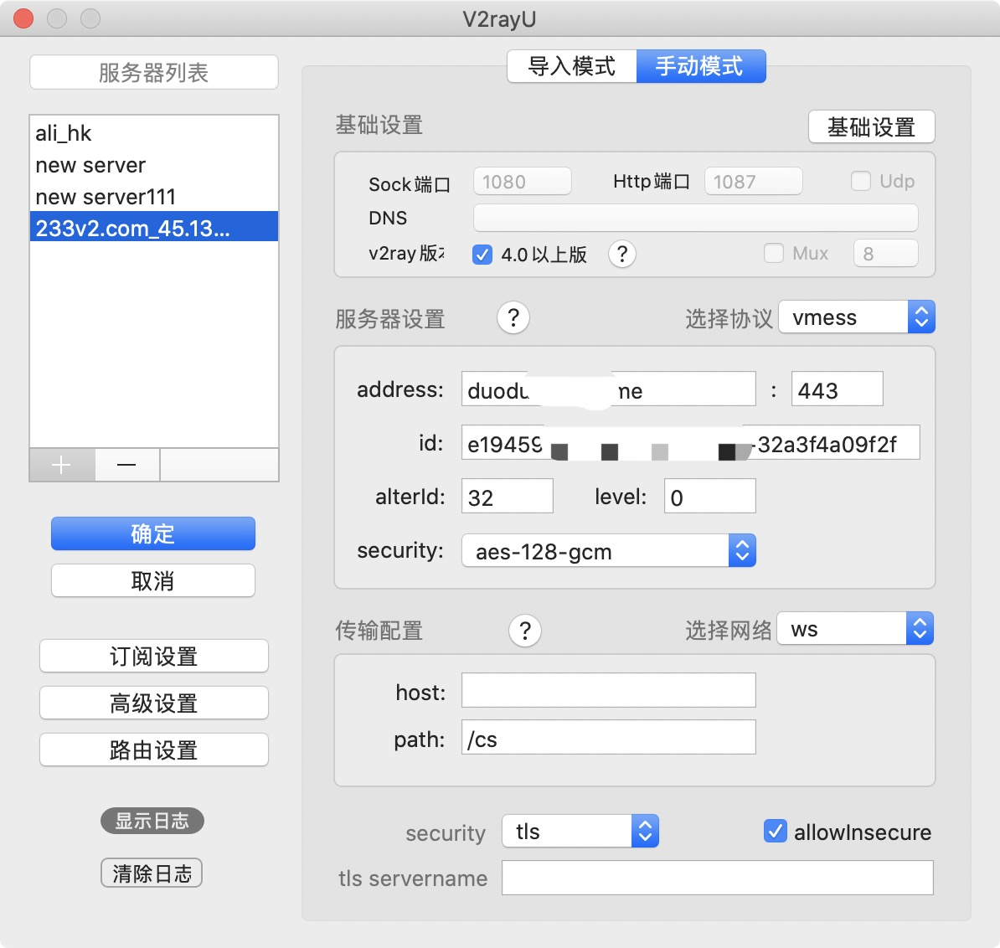

# v2ray搭建教程

## 简介
通过https的443端口伪造。使用443端口转发到v2ray的端口，
使用websocket+tls传输协议。的安装教程
#### 与本文无关内容：↓
如果只有tcp方式简单搭建可以看[别人的github](https://github.com/233boy/v2ray/wiki/V2Ray%E6%90%AD%E5%BB%BA%E8%AF%A6%E7%BB%86%E5%9B%BE%E6%96%87%E6%95%99%E7%A8%8B
)。我搭建的时候出现点问题[故障解决方案看这](https://github.com/crazypeace/v2ray)

## 安装宝塔
### 安装
```Bash
curl -sSO http://download.bt.cn/install/new_install.sh && bash new_install.sh
```
一路敲`y`就ok！


这里把`url`、`username`、`password`都记住了
### 安装nginx
打开上面记住的`url`，分别输入账号密码。



### 添加站点
首先要有一个域名，可以在阿里云买，几块钱就可以买个垃圾域名。
解析好你服务器的ip。




## 安装v2ray
### 安装官方脚本
安装
```Bash
bash <(curl -L https://raw.githubusercontent.com/v2fly/fhs-install-v2ray/master/install-release.sh)
```
卸载
```Bash
bash <(curl -L https://raw.githubusercontent.com/v2fly/fhs-install-v2ray/master/install-release.sh) --remove
```
最新官方脚本已经不显示uuid和端口了。
可以↓样
```Bash
[root@vultr ~] # cat /proc/sys/kernel/random/uuid 
9ec43ee9-651d-455d-ac8f-c06dtfc79b01
```
## 配置宝塔
### 配置ssl
这里我也不截图了，进入宝塔面板，点击左侧网站，找到刚添加的域名后面的设置按钮 ----- 找到 ssl 选项，选择 Let's Encrypt ，推荐使用文件方式验证，输入你的邮箱，如果你的域名 ip 解析正确的话直接点提交就申请 ssl 成功了，成功后如图：


### 修改配置文件：
接下来进入 修改网站配置文件 点击配置文件，找到 `#SSL-END`，大概在 22 行左右，在其下面添加如下代码：
```Bash
    location /cs
    {
        proxy_pass http://127.0.0.1:你想使用的端口号;
        proxy_redirect off;
        proxy_http_version 1.1;
        proxy_set_header Upgrade $http_upgrade;
        proxy_set_header Connection "upgrade";
        proxy_set_header Host $http_host;
        proxy_read_timeout 300s;
    }
```
- 1、其中第一行的 cs 是你自己 ws 的 path，斜杠不要删除，可以自己修改,也可以不改；
- 2、还记得用官方脚本安装 v2ray 后出现的 port 吗，我叫大家记住的，这个 port 后面的就是你的端口号。修改上面代码后保存，如下图：


### 配置 V2ray 配置文件：
`vi /usr/local/etc/v2ray/config.json`
编辑配置文件
```json
{
  "policy": {
    "levels": {
      "0": {
        "uplinkOnly": 0,
        "downlinkOnly": 0,
        "connIdle": 150,
        "handshake": 4
      }
    }
  },
  "inbound": {
    "listen": "127.0.0.1",
    "port": 31914,    # 这里填写你的你刚才定的端口号，复制脚本请产出这句注释
    "protocol": "vmess",
    "settings": {
      "clients": [
        {
          "id": "e1bc89df-c245-4da6-90cc-2d20ad80a611",    # 这里填写你的刚cat 看到的 UUID，复制脚本请删除这句注释
          "level": 1,
          "alterId": 32
        }
      ]
    },
    "streamSettings": {
      "network": "ws",
      "security": "auto",
      "wsSettings": {
        "path": "/cs",   #这里填是你自己 ws 的 path,如果修改配置文件的时候没有修改过就不管，复制脚本请删除这句注释
        "headers": {
          "Host": "www.xxx.com"  #这里填写你的域名，复制脚本请删除这句注释
        }
      }
    }
  },
  "outbound": {
    "protocol": "freedom",
    "settings": { }
  },
  "outboundDetour": [
    {
      "protocol": "blackhole",
      "settings": { },
      "tag": "blocked"
    }
  ],
  "routing": {
    "strategy": "rules",
    "settings": {
      "rules": [
        {
          "type": "field",
          "ip": [
            "0.0.0.0/8",
            "10.0.0.0/8",
            "100.64.0.0/10",
            "127.0.0.0/8",
            "169.254.0.0/16",
            "172.16.0.0/12",
            "192.0.0.0/24",
            "192.0.2.0/24",
            "192.168.0.0/16",
            "198.18.0.0/15",
            "198.51.100.0/24",
            "203.0.113.0/24",
            "::1/128",
            "fc00::/7",
            "fe80::/10"
          ],
          "outboundTag": "blocked"
        }
      ]
    }
  }
}

```
注意：端口号和 uuid 填错一个字母数字都不能连接！

## 配置 CDN
大家就看这篇文章 [https://zhang.ge/5149.html](https://zhang.ge/5149.html) 吧，配置 cloudflare 的免费 cdn，只看这篇文章的 CNAME 接入方式就可以了

也可以不使用 cdn，实测都是很稳定的，不会被检测到
## 最后一步
开启防火墙端口或者直接关闭防火墙，
```bash
systemctl stop 
service  iptables stop
```
我们安装的宝塔面板自带开端口功能，很方便，如图：

#### 启动 v2ray
```Bash
#此命令启动 v2ray
systemctl start v2ray
#更多命令
service v2ray start|stop|status|reload|restart|force-reload
```
## 说下怎么使用客户端连接
### windows

### Mac


## 还有个提速方案：
安装bbr.

# 参考
- [https://hexsen.com/my-domain-change-history.html](https://hexsen.com/my-domain-change-history.html)

- [https://www.ddayh.com/1136.html](https://www.ddayh.com/1136.html)


